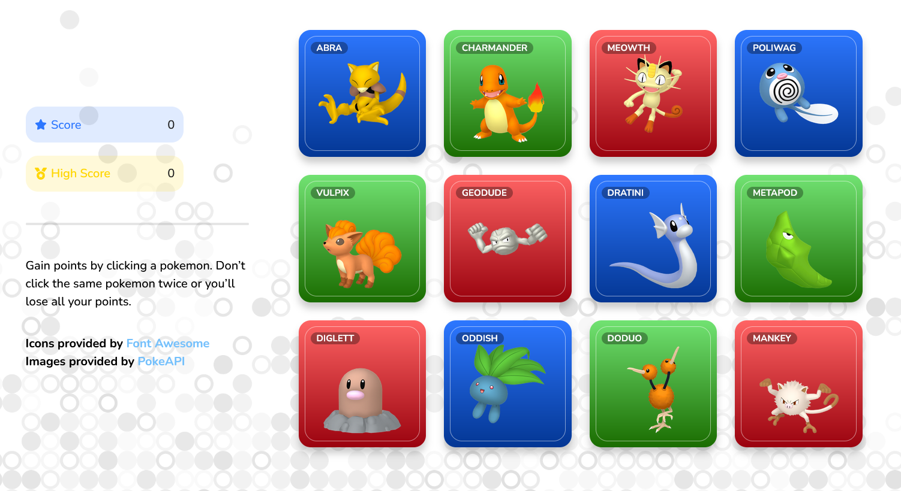

# Pokémon Memory Card Game 🧠🐸
A Pokémon memory card game made with React.js. You gain points by clicking a pokemon, and lose all your points by clicking the same twice.

🌐 [Live Preview](https://kenua.github.io/pokemon-memory-card-game/)

